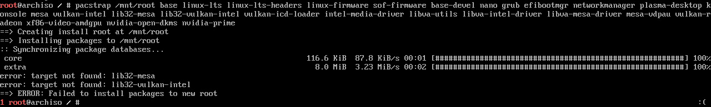

# Arch Linux 安裝指南(中文版)

#ArchLinux #Linux #iceless
>**此文件翻譯自IcelessDocs。**
>
>譯者: 靛夜子洛 (PEIC_sys_0x80)


## 1. 下載ISO

這邊提供了三種下載方式，擇一即可:

- [直接下載最新版本](https://geo.mirror.pkgbuild.com/iso/2025.08.01/archlinux-x86_64.iso)
- [全球鏡像伺服器](https://geo.mirror.pkgbuild.com/iso/2025.08.01/)
- [伺服器列表](https://archlinux.org/download)

## 2. 開機

將你的裝置開機進入這個iso。

## 3. 進行分區

使用ISO中內建的[cfdisk](https://cfdisk.com/)來給要安裝Arch Linux的硬碟分區，**但先不要格式化**。

1. **UEFI啟動分區**,約300MB
2. **Swap分區**,可根據需要來設定大小，或是不使用
3. **Root分區**，至少4GB。

你可以使用以下指令來進行設定，並在設定完成之後寫入硬碟:

```bash
cfdisk  /dev/YourDisk
```

> 如果你不知道你的硬碟有哪些，可以使用`lsblk`來查看目前你電腦上已安裝的所有硬碟。

## 4. 格式化分區

首先，先把UEFI分區格式化成FAT32:

```bash
mkfs.fat -F 32 /dev/YourDiskPartitionForUEFI
```

然後，格式化Swap(如果你有建立)

```bash
mkswap /dev/YourDiskPartitionForSwap
```

最後，把Root分區格式化成EXT4

```bash
mkfs.ext4 /dev/YourDiskPartitionForRoot
```

## 5. 掛載Root分區

掛載Root分區準備安裝:

```bash
mount /dev/YourDiskPartitionForRoot /YourDiskPartitionForRoot/MountPoint
```

## 6. 連接到網際網路

如果你是使用乙太網路來連接，通常會自動設定，但如果你要使用WiFi，就需要使用[iwd](https://wiki.archlinux.org/title/Iwd)的`iwctl`來手動連接。

首先，進入`iwctl`的Shell:

```bash
iwctl
```

然後在這個shell中輸入:

```bash
station wlan0 connect "YourSSID"
```

>如果你的WiFi需要密碼，它會提示你輸入密碼。


最後離開這個shel:

```bash
exit
```


## 7.安裝 Arch Linux

現在我們需要將一些包安裝進root分區的根目錄中，執行以下指令來安裝:

```bash
pacstrap /YourDiskPartitionForRoot/MountPoint base linux-lts linux-lts-headers linux-firmware sof-firmware base-devel nano grub sudo efibootmgr networkmanager
```

>如果你需要ssh，可以安裝 `openssh`

**常用的顯示驅動**:

晶片|包
-|-
Intel iGPU|`mesa vulkan-intel lib32-mesa lib32-vulkan-intel vulkan-icd-loader intel-media-driver libva-utils`
Intel Arc|`mesa vulkan-intel [lib32-mesa lib32-vulkan-intel] libva-intel-driver intel-media-driver`
AMD iGPU/dGPU|`mesa libva-mesa-driver mesa-vdpau vulkan-radeon xf86-video-amdgpu`
QEMU via virtio-vga-gl|`mesa mesa-utils vulkan-radeon xf86-video-vesa`
Nvidia Any|`nvidia-dkms nvidia-prime`
Nvidia New (open source) >= 3050|`nvidia-open-dkms nvidia-prime`


執行之後，可能需要較長的時間處理，請等待它處理完成，並全程保持網路連線。

### 7-1 找不到 `lib32-mesa` 與 `lib32-vulkan-intel` 的解決方案 



如果你在安裝相關驅動時遇到`lib32-mesa`與`lib32-vulkan-intel`找不到的情況(如上圖)，請依照以下步驟操作來解決:


首先，用編輯器打開`/etc/pacman.conf`:
```bash
nano /etc/pacman.conf
```

然後往下滑到最下面，找到:
```
# [multilib]
# Include = /etc/pacman.d/mirrorlist
```

把它註解符號拔掉:
```
[multilib]
Include = /etc/pacman.d/mirrorlist
```

然後存檔並關閉編輯器(如果你使用nano，先使用`Ctrl`+`O`,`Enter`儲存文件，然後`Ctrl`+`X`關閉)。

## 8.製作 `fstab` 文件

接下來就是安裝Linux最關鍵的一步: 生成 `fstab` 文件。
`fstab` 文件的主要作用就是定義系統開機時如何掛載開機所需的磁區，如果這個文件出錯了，可能會導致系統無法啟動。當然也可以透過這個文件實現netboot等進階操作。

要搓這個`fstab`文件，我們首先需要掛載所有需要的分區。 

>**※** 剛剛我們已經掛載了root分區，因此無須再次掛載。

首先，建立一個用於掛載UEFI分區的資料夾，並將UEFI分區掛上去:

```bash
mkdir -p /YourDiskPartitionForRoot/MountPoint/boot/efi
```

```bash
mount /dev/YourDiskPartitionForUEFI /YourDiskPartitionForRoot/MountPoint/boot/efi
```

如果你有建立swap，也把它啟用:

```bash
swapon /dev/YourDiskPartitionForSwap
```

然後就可以生成`fstab`文件:
```bash
genfstab -U /YourDiskPartitionForRoot/MountPoint > /YourDiskPartitionForRoot/MountPoint/etc/fstab
```

## 9. 設定Arch Linux

### 9-1 進入Root分區

在繼續之前我們需要先進入Root分區，並且**接下來所有指令都必須在chroot中執行**。

```bash
arch-chroot /YourDiskPartitionForRoot/MountPoint
```

### 9-2 設定使用者

設定Root使用者密碼:

```bash
passwd
```

然後輸入新的密碼。

然後在這個Arch Linux中建立一個新的使用者:

```bash
useradd -m -G wheel -s /bin/bash YourUserName
```

給這個使用者設定一個密碼:

```bash
passwd YourUserName
```

### 9-3 設定`sudo`

設定了`sudo`之後使用者才能執行`sudo`指令。

輸入以下指令來編輯`sudo`的設定(這裡使用nano作為編輯器，你可以換成vim或其他你喜歡的編輯器):

```bash
EDITOR=nano visudo
```

然後找到這些:

```
## Uncomment to allow members of group wheel to execute any command
# %wheel ALL=(ALL:ALL) ALL
```

這通常會在你現在開的這文件的末尾，找到之後將它取消註釋:

```
 %wheel ALL=(ALL:ALL) ALL
```

然後存檔並關閉編輯器(如果你使用nano，先使用`Ctrl`+`O`,`Enter`儲存文件，然後`Ctrl`+`X`關閉)。

### 9-4 啟用系統服務

啟用網路管理員:

```bash
systemctl enable NetworkManger
```

啟用ssh(如果你需要的話):

```bash
systemctl enable sshd
```

### 9-5 Nvidia 圖形驅動程式

如果有裝Nvidia顯示卡，請執行以下指令安裝Nvidia圖形驅動，如果你在安裝階段就一起裝了的話則可以跳過:

```bash
pacman -S nvidia-dkms nvidia-utils lib32-nvidia-utils
```

### 9-6 設定主機名稱

你可以用以下指令自訂主機名稱:

```bash
echo "YourHost" > /etc/hostname
```

### 9-7 時區設定
列出可用的時區
```bash
timedatectl list-timezone
```

然後設定你的時區
```bash
timedatectl set-timezone Your/Timezone
```

設定自動時間同步
```bash
timedatectl set-ntp true
```

如果沒效就用這個
```bash
systemctl enable systemd-timesyncd
```


### 9-8 安裝UEFI與GRUB引導

手動安裝 GRUB:

```bash
grub-install
```

如果是可攜式儲存裝置則使用這個:

```bash
grub-install --removable --recheck
```

然後，搓一個 `grub.cfg` 檔案:

```bash
grub-mkconfig -o /boot/grub/grub.cfg
```

### 9-8 退出`chroot`
到這邊，安裝基本已經完成了，使用以下指令退出`chroot`:

```bash
exit
```

## 10 完成

卸載所有分區:

```bash
unmount -a
```

然後重開機

```bash
reboot
```

重開機之後如果你要連接wifi，可以用這個:

```bash
nmcli device wifi connect "SSID" password "PASSWORD"
```
這邊提供了三種下載方式，擇一即可:

- [直接下載最新版本](https://geo.mirror.pkgbuild.com/iso/2025.08.01/archlinux-x86_64.iso)
- [全球鏡像伺服器](https://geo.mirror.pkgbuild.com/iso/2025.08.01/)
- [伺服器列表](https://archlinux.org/download)

## 2. 開機

將你的裝置開機進入這個iso。

## 3. 進行分區

使用ISO中內建的[cfdisk](https://cfdisk.com/)來給要安裝Arch Linux的硬碟分區，**但先不要格式化**。

1. **UEFI啟動分區**,約300MB
2. **Swap分區**,可根據需要來設定大小，或是不使用
3. **Root分區**，至少4GB。

你可以使用以下指令來進行設定，並在設定完成之後寫入硬碟:

```bash
cfdisk  /dev/YourDisk
```

> 如果你不知道你的硬碟有哪些，可以使用`lsblk`來查看目前你電腦上已安裝的所有硬碟。

## 4. 格式化分區

首先，先把UEFI分區格式化成FAT32:

```bash
mkfs.fat -F 32 /dev/YourDiskPartitionForUEFI
```

然後，格式化Swap(如果你有建立)

```bash
mkswap /dev/YourDiskPartitionForSwap
```

最後，把Root分區格式化成EXT4

```bash
mkfs.ext4 /dev/YourDiskPartitionForRoot
```

## 5. 掛載Root分區

掛載Root分區準備安裝:

```bash
mount /dev/YourDiskPartitionForRoot /YourDiskPartitionForRoot/MountPoint
```

## 6. 連接到網際網路

如果你是使用乙太網路來連接，通常會自動設定，但如果你要使用WiFi，就需要使用[iwd](https://wiki.archlinux.org/title/Iwd)的`iwctl`來手動連接。

首先，進入`iwctl`的Shell:

```bash
iwctl
```

然後在這個shell中輸入:

```bash
station wlan0 connect "YourSSID"
```

>如果你的WiFi需要密碼，它會提示你輸入密碼。


最後離開這個shel:

```bash
exit
```


## 7.安裝 Arch Linux

現在我們需要將一些包安裝進root分區的根目錄中，執行以下指令來安裝:

```bash
pacstrap /YourDiskPartitionForRoot/MountPoint base linux-lts linux-lts-headers linux-firmware sof-firmware base-devel nano grub sudo efibootmgr networkmanager
```

>如果你需要ssh，可以安裝 `openssh`

**常用的顯示驅動**:

晶片|包
-|-
Intel iGPU|`mesa vulkan-intel lib32-mesa lib32-vulkan-intel vulkan-icd-loader intel-media-driver libva-utils`
Intel Arc|`mesa vulkan-intel lib32-mesa lib32-vulkan-intel libva-intel-driver intel-media-driver`
AMD iGPU/dGPU|`mesa libva-mesa-driver mesa-vdpau vulkan-radeon xf86-video-amdgpu`
QEMU via virtio-vga-gl|`mesa mesa-utils vulkan-radeon xf86-video-vesa`
Nvidia Any|`nvidia-dkms nvidia-prime`
Nvidia New (open source) >= 3050|`nvidia-open-dkms nvidia-prime`


執行之後，可能需要較長的時間處理，請等待它處理完成，並全程保持網路連線。

## 8.製作 `fstab` 文件

接下來就是安裝Linux最關鍵的一步: 手搓 `fstab` 文件，這個 `fstab` 文件的主要作用就是定義系統開機時如何掛載開機所需的磁區，如果這個文件出錯了，可能會導致系統無法啟動。當然也可以透過這個文件實現netboot等進階操作。

要搓這個`fstab`文件，我們首先需要掛載所有需要的分區。 

>**※** 剛剛我們已經掛載了root分區，因此無須再次掛載。

首先，建立一個用於掛載UEFI分區的資料夾，並將UEFI分區掛上去:

```bash
mkdir -p /YourDiskPartitionForRoot/MountPoint/boot/efi
```

```bash
mount /dev/YourDiskPartitionForUEFI /YourDiskPartitionForRoot/MountPoint/boot/efi
```

如果你有建立swap，也把它啟用:

```bash
swapon /dev/YourDiskPartitionForSwap
```

然後就可以生成`fstab`文件:
```bash
genfstab -U /YourDiskPartitionForRoot/MountPoint > /YourDiskPartitionForRoot/MountPoint/etc/fstab
```

## 9. 設定Arch Linux

### 9-1 進入Root分區

在繼續之前我們需要先進入Root分區，並且**接下來所有指令都必須在chroot中執行**。

```bash
arch-chroot /YourDiskPartitionForRoot/MountPoint
```

### 9-2 設定使用者

設定Root使用者密碼:

```bash
passwd
```

然後輸入新的密碼。

然後在這個Arch Linux中建立一個新的使用者:

```bash
useradd -m -G wheel -s /bin/bash YourUserName
```

給這個使用者設定一個密碼:

```bash
passwd YourUserName
```

### 9-3 設定`sudo`

設定了`sudo`之後使用者才能執行`sudo`指令。

輸入以下指令來編輯`sudo`的設定(這裡使用nano作為編輯器，你可以換成vim或其他你喜歡的編輯器):

```bash
EDITOR=nano visudo
```

然後找到這些:

```
## Uncomment to allow members of group wheel to execute any command
# %wheel ALL=(ALL:ALL) ALL
```

這通常會在你現在開的這文件的末尾，找到之後將它取消註釋:

```
 %wheel ALL=(ALL:ALL) ALL
```

然後存檔並關閉編輯器(如果你使用nano，先使用`Ctrl`+`O`,`Enter`儲存文件，然後`Ctrl`+`X`關閉)。

### 9-4 啟用系統服務

啟用網路管理員:

```bash
systemctl enable NetworkManger
```

啟用ssh(如果你需要的話):

```bash
systemctl enable sshd
```

### 9-5 Nvidia 圖形驅動程式

如果有裝Nvidia顯示卡，請執行以下指令安裝Nvidia圖形驅動:

```bash
pacman -S nvidia-dkms nvidia-utils lib32-nvidia-utils
```

### 9-6 設定主機名稱

你可以用以下指令自訂主機名稱:

```bash
echo "YourHost" > /etc/hostname
```

### 9-7 時區設定
列出可用的時區
```bash
timedatectl list-timezone
```

然後設定你的時區
```bash
timedatectl set-timezone Your/Timezone
```

設定自動時間同步
```bash
timedatectl set-ntp true
```

如果沒效就用這個
```bash
systemctl enable systemd-timesyncd
```


### 9-8 安裝UEFI與GRUB引導

手動安裝 GRUB:

```bash
grub-install
```

如果是可攜式儲存裝置則使用這個:

```bash
grub-install --removable --recheck
```

然後，搓一個 `grub.cfg` 檔案:

```bash
grub-mkconfig -o /boot/grub/grub.cfg
```

### 9-8 退出`chroot`
到這邊，安裝基本已經完成了，使用以下指令退出`chroot`:

```bash
exit
```

## 10 完成

卸載所有分區:

```bash
unmount -a
```

然後重開機

```bash
reboot
```

重開機之後如果你要連接wifi，可以用這個:

```bash
nmcli device wifi connect "SSID" password "PASSWORD"
```