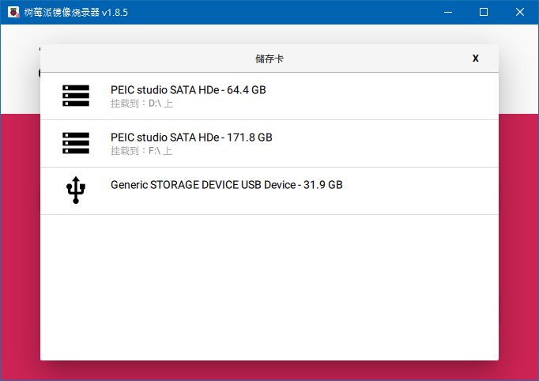

# Respberry Pi OS 安裝指南
#資訊科技  #樹梅派 
## 1.下載
先從[樹梅派官方網站](https://www.raspberrypi.com/software/) 下載並安裝樹梅派系統映像燒錄器:

## 2.燒錄
### 2-1.打開樹梅派系統映像燒錄器

![[Raspberry Pi-imager.png]]

### 2-2.選擇你的樹梅派型號

點擊「CHOOSE DEVICE」

然後選擇你的樹梅派型號(這裡以pi 5為例)

### 2-3.選擇系統映像和SD卡

這邊可以選擇樹梅派官方的pi-OS，也可以依需求選擇裡面各種其他OS。

如果要用自訂的鏡像，可以滑到最下面，選擇`use custom`，然後選擇要燒錄的鏡像，這個鏡像可以是`.img`檔案，也可以是壓縮過的`.img.xz`等檔案。

然後選擇你要刷的儲存裝置，選擇你要刷的那張SD卡就行了。

>注意: 如果使用轉接卡或標準尺寸SD卡，請務必把物理防寫開關關掉。

### 2-4.刷入
都選好之後，按下面的「NEXT」按鈕，他會提示接下來會清除SD卡資料，按「是」就開始了。

接著只要等它寫入完就完成了。

## 3.開機
將燒錄好的SD卡插入樹梅派，然後通電開機。

## e.初始設定
開機之後可能會看到一些初始設定畫面，完成初始設定。
初始設定的畫面會因不同系統而有所不同，這裡就不展示了。
